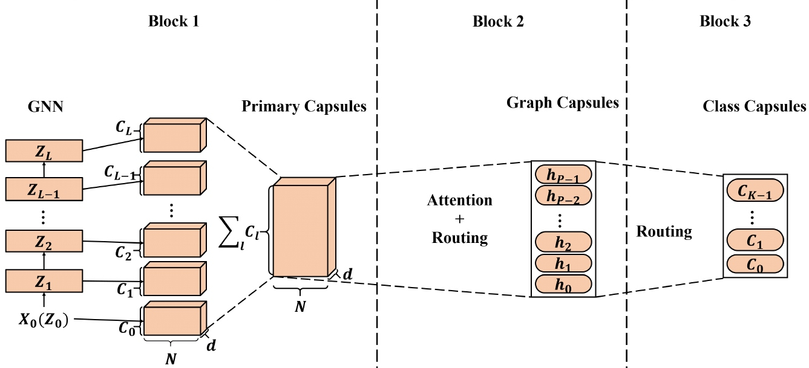
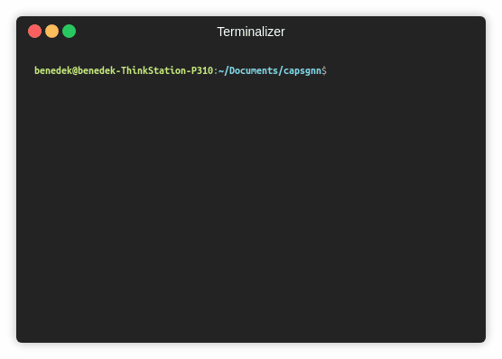

CapsGNN
============================================
A PyTorch implementation of "Capsule Graph Neural Network" (ICLR 2019).
<p align="center">
  
</p>
<p align="justify">
The high-quality node embeddings learned from the Graph Neural Networks (GNNs) have been applied to a wide range of node-based applications and some of them have achieved state-of-the-art (SOTA) performance. However, when applying node embeddings learned from GNNs to generate graph embeddings, the scalar node representation may not suffice to preserve the node/graph properties efficiently, resulting in sub-optimal graph embeddings. Inspired by the Capsule Neural Network (CapsNet), we propose the Capsule Graph Neural Network (CapsGNN), which adopts the concept of capsules to address the weakness in existing GNN-based graph embeddings algorithms. By extracting node features in the form of capsules, routing mechanism can be utilized to capture important information at the graph level. As a result, our model generates multiple embeddings for each graph to capture graph properties from different aspects. The attention module incorporated in CapsGNN is used to tackle graphs with various sizes which also enables the model to focus on critical parts of the graphs. Our extensive evaluations with 10 graph-structured datasets demonstrate that CapsGNN has a powerful mechanism that operates to capture macroscopic properties of the whole graph by data-driven. It outperforms other SOTA techniques on several graph classification tasks, by virtue of the new instrument.</p>


This repository provides a PyTorch implementation of CapsGNN as described in the paper:

> Capsule Graph Neural Network.
> Zhang Xinyi, Lihui Chen.
> ICLR, 2019.
> [[Paper]](https://openreview.net/forum?id=Byl8BnRcYm)

The core Capsule Neural Network implementation adapted is available [[here]](https://github.com/benedekrozemberczki/CapsGNN).

### Requirements
The codebase is implemented in Python 3.5.2. package versions used for development are just below.
```
networkx          1.11
tqdm              4.28.1
numpy             1.15.4
pandas            0.23.4
texttable         1.5.0
scipy             1.1.0
argparse          1.1.0
torch             0.4.1
torch-scatter     1.1.2
torch-sparse      0.2.2
torch-cluster     1.2.4
torch-geometric   1.0.3
torchvision       0.2.1
```
### Datasets
The code takes graphs for training from an input folder where each graph is stored as a JSON. Graphs used for testing are also stored as JSON files. Every node id and node label has to be indexed from 0. Keys of dictionaries are stored strings in order to make JSON serialization possible.

Every JSON file has the following key-value structure:

```javascript
{"edges": [[0, 1],[1, 2],[2, 3],[3, 4]],
 "labels": {"0": "A", "1": "B", "2": "C", "3": "A", "4": "B"},
 "target": 1}
```
The **edges** key has an edge list value which descibes the connectivity structure. The **labels** key has labels for each node which are stored as a dictionary -- within this nested dictionary labels are values, node identifiers are keys. The **target** key has an integer value which is the class membership.

### Outputs

The predictions are saved in the `output/` directory. Each embedding has a header and a column with the graph identifiers. Finally, the predictions are sorted by the identifier column.

### Options
Training a CapsGNN model is handled by the `src/main.py` script which provides the following command line arguments.

#### Input and output options
```
  --training-graphs   STR    Training graphs folder.      Default is `dataset/train/`.
  --testing-graphs    STR    Testing graphs folder.       Default is `dataset/test/`.
  --prediction-path   STR    Output predictions file.     Default is  `output/watts_predictions.csv`.
```
#### Model options
```
  --epochs                      INT     Number of epochs.                  Default is 10.
  --batch-size                  INT     Number fo graphs per batch.        Default is 32.
  --gcn-filters                 INT     Number of filters in GCNs.         Default is 2.
  --gcn-layers                  INT     Number of GCNs chained together.   Default is 5.
  --inner-attention-dimension   INT     Number of neurons in attention.    Default is 20.  
  --capsule-dimensions          INT     Number of capsule neurons.         Default is 8.
  --number-of-capsules          INT     Number of capsules in layer.       Default is 8.
  --weight-decay                FLOAT   Weight decay of Adam.              Defatuls is 10^-6.
  --lambd                       FLOAT   Regularization parameter.          Default is 1.0.
  --learning-rate               FLOAT   Adam learning rate.                Default is 0.01.
```
### Examples
The following commands learn a model and save the predictions. Training a model on the default dataset:
```
python src/main.py
```
<p align="center">
  
</p>

Training a CapsGNNN model for a 100 epochs.
```
python src/main.py --epochs 100
```
Changing the batch size.
```
python src/main.py --batchs-size 128
```
